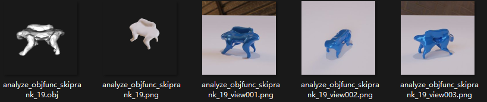
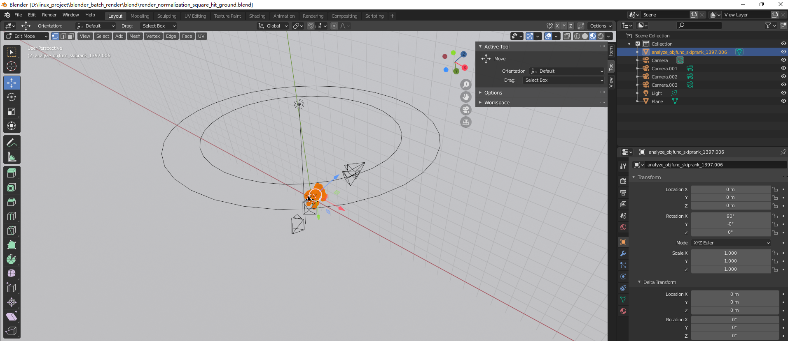
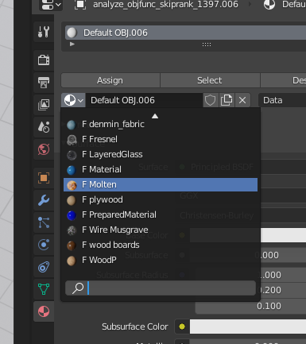

# blender-batch-render-with-.blend-background-

Batch-render a folder of `.obj` files into PNGs using a pre-built Blender scene
(camera + lighting + HDRI + materials), driven from the CLI in `--background`
headless mode. The whole render setup lives inside a `.blend`; the script just
loops through OBJ files, applies a chosen material, and writes images.

> Originally written for Blender 2.7x. **Patched and verified on Blender 4.0.2 (macOS arm64)** — see [Blender 4.x compatibility](#blender-4x-compatibility) below. The canonical, always-up-to-date working notes are in [`CLAUDE.md`](CLAUDE.md).



## Quick start (Blender 4.x)

```bash
# 1. Put your .obj files in some directory
ls /tmp/chair_test/
# chair.obj  chair.mtl

# 2. Run from the repo root (PYTHONPATH=$PWD is required — see "Gotchas")
PYTHONPATH=$PWD /Applications/Blender.app/Contents/MacOS/Blender --background \
  blend/render_normalization_square_hit_ground.blend \
  --python obj_render_background_blend.py -- \
  -in /tmp/chair_test/ -m Material

# Output: /tmp/chair_test/chair.png  (+ chair_view001/002/003.png with --multiview)
```

The `--` separator is **mandatory**: everything after it is forwarded to the
script (`-in`, `-m`, `--multiview`, `--transparent_background`).

On Linux, replace the Blender path with `blender` (must be in `$PATH`).

## CLI flags (after the `--`)

| Flag | Default | Purpose |
|---|---|---|
| `-in <dir>` | (required) | Folder containing `.obj` files. Output PNGs are written next to them. |
| `-m <material>` | `Material` | Override material on all imported meshes. Use `NULL` to keep OBJ-original material. |
| `--multiview` | off | Render from all 4 cameras (`Camera`/`.001`/`.002`/`.003`) → `_view001.png` etc. |
| `--transparent_background` | off | Force `film_transparent=True` (already set in `hit_ground.blend`). |

## Materials available in `hit_ground.blend`

13 material slots ship with the scene. Verified visually (rendered on a chair OBJ):

| `-m` value | Looks like |
|---|---|
| `Material` | Deep-indigo glossy plastic — **the "blue chair" from the original paper figure** |
| `PreparedMaterial` | Brighter saturated blue plastic |
| `NULL` | Keeps the OBJ's own materials (white-ish matte plastic for the test chair) |
| `WoodP` | Light brown wood grain |
| `wood boards` | Dark walnut |
| `Chocolate Swirl` | Dark chocolate with swirl pattern |
| `1970_tiles` | Brown-red checkered leather |
| `Molten` | Golden lava granules (popcorn-like) |
| `LayeredGlass` | Translucent glass |
| `Fresnel` | Dark grey/black with edge reflection |
| `Wire Musgrave` | Mother-of-pearl-like noise |
| `denmin_fabric`, `plywood` | **Both render as bright pink-purple** — names misleading; likely a shared node group inside the .blend was edited |

## Scenes (`blend/`)

| File | Use |
|---|---|
| `render_normalization_square_hit_ground.blend` | **Main scene used by Quick start.** 4 cameras + ground plane + courtyard.exr HDRI + 13 materials. Ships with a built-in dog mesh that the script deletes during cleanup before importing your OBJ. |
| `render_normalization_template.blend` | Empty template (just a Plane). Starting point for new scenes. |
| `render_normalization_square_output_template.blend` | Empty output template. |
| `render_normalization_square_output__rotate_video.blend` | Rotation-video scene with BezierCircle + animated camera. **Not compatible** with this script: render output is set to a video format, and the cleanup step's `KEEP` set would delete the BezierCircle/extra empties. |

The script's cleanup phase preserves only this set:

```python
KEEP = {'Camera', 'Light', 'Camera.001', 'Camera.002', 'Camera.003', 'Plane'}
```

If you swap to a different `.blend` that has additional objects (track-to empties, multiple lights, curves), edit `KEEP` accordingly or those objects will be removed before render.

## Blender 4.x compatibility

Commit [`49b7942`](https://github.com/tianyilt/blender-batch-render-with-.blend-background-/commit/49b7942) ports the script from Blender 2.7x to 4.x:

| Old (2.7x) | New (4.x) | Why |
|---|---|---|
| `bpy.ops.object.delete()` | `bpy.data.objects.remove(obj, do_unlink=True)` | `ops.delete` needs a context override under `--background`; `data.remove` doesn't |
| `bpy.ops.import_scene.obj()` | `bpy.ops.wm.obj_import()` | Blender 4.0 dropped the legacy Python OBJ importer for the C++ one |
| `bpy.ops.object.editmode_toggle()` | `bpy.ops.object.mode_set(mode='EDIT' / 'OBJECT')` | The toggle op now needs an explicit mode |
| `obj_basename[0]` (typo) | `obj_basename` | The original took only the first character of the filename, so multiview outputs had truncated names |

A `util/` shim was added (an `__init__.py` plus a symlink from `util/argparse4blender.py` → `argparse4blender.py`) so `from util.argparse4blender import …` resolves. This shim lives at the repo root, which is why `PYTHONPATH=$PWD` is required.

## Gotchas

| Symptom | Cause | Fix |
|---|---|---|
| `ModuleNotFoundError: No module named 'util'` | `PYTHONPATH` not set, or `util/` missing | Run with `PYTHONPATH=$PWD`; verify `util/__init__.py` exists |
| `Operator bpy.ops.object.delete.poll() failed` | Running an unpatched script under Blender 4.x in headless mode | Pull commit `49b7942` or later |
| `import_scene.obj has no attribute …` | Same — old API on 4.x | Same |
| `Cannot write a single file with an animation format selected` | You used `_rotate_video.blend` whose render output format is a video codec | Use `hit_ground.blend`, or set `bpy.context.scene.render.image_settings.file_format = 'PNG'` in the script |
| Render comes out completely empty / all-white | Input mesh too small, symmetric, or low-poly: the modifier stack (Decimate 0.6 + Smooth 2.0 ×2) collapses it. The default Blender cube hits this. | Use a real mesh — there's a chair available inside `_rotate_video.blend` (`analyze_objfunc_skiprank_19`) you can export to OBJ |

## Why this exists

Many existing batch-render tools ([blender_batch_render](https://github.com/bbutkovic/blender_batch_render), [Batch-Render-Tools](https://github.com/RayMairlot/Batch-Render-Tools)) provide a GUI/TUI for rendering many files but assume you'll build the scene interactively. For **paper-figure rendering**, where camera/light/material/HDRI all matter, you want to design the scene once in the GUI, save the `.blend`, and then iterate over OBJ files headlessly. That's what this repo is.

The original setup was tuned for normalised ShapeNet chairs — 4 fixed cameras give a canonical-pose view, the modifier stack smooths low-poly meshes, and the courtyard HDRI provides an out-of-the-box "papery" look.





## For Claude / agentic users

[`CLAUDE.md`](CLAUDE.md) is the canonical engineering-notes file: working command, full `.blend` inventory with object dumps, every patch line-by-line, and an exhaustive troubleshooting table. Read it before changing the script — it captures things that are easy to break (e.g. `KEEP` set, `--` separator, `PYTHONPATH`).
