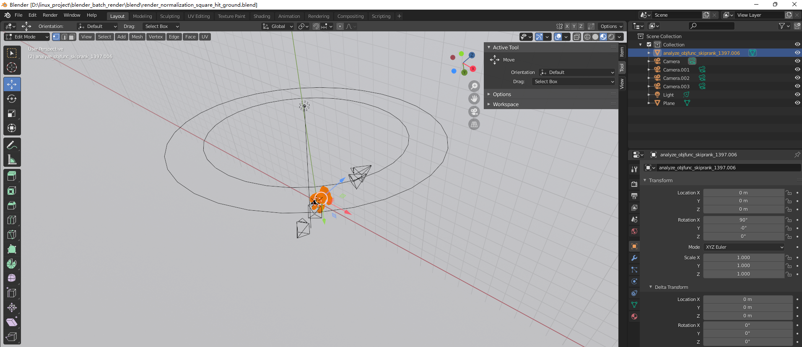
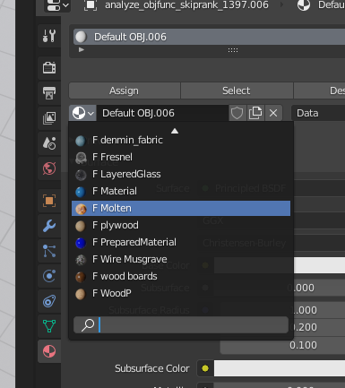

# a python prompt cli script for blender batch render

In deep generative geometry learning, we always get many .obj files to be rendered. Our rendered images should be will designed via various camera angle, geometry material and environments setting.

Many prior blender batch render tool [1](https://github.com/bbutkovic/blender_batch_render) ,[2](https://github.com/RayMairlot/Batch-Render-Tools) provides auto batch rendering for many files and a set of gui or

 tui interface. However, when it comes to **paper-oriented render scene**, we have to open blender/maya to build a scene to render.

We find a method to solve this. Just separate a folder of obj file io with  the whole render setting(render engine, camera, background image, geometry modifier, texture/materials). The input is folder name ,then scripts will find corresponding obj file (figure1 left), and then create rendered images with transparent background, various material, camera position or not.


### **Usage**

1. Open blend/render_normalization_square_hit_ground.blend by blender, and setup
- camera
- light
- mesh modifier: NEED TO CHANGE PYHTON SCRIPT ACCORDING TO .blender FILE
- render background
- shade material(bpy.data.materials["Material"])






2. Run

for quick start,we recommend that

```
blender --background blend/render_normalization_square_hit_ground.blend --python obj_render_background_blend.py -- -in {path_to_dir} --multiview
```

```
blender --background blend/render_normalization_square_hit_ground.blend --python obj_render_background_blend.py -- -in D:\your_folder -m NULL
```

if you want to define the render effects, you can use .blend file to solve all rendering and geometry postprocessing problems

tips for .blend config:First open render_normalization_template.blend by blender, and setup

​    'Camera', 'Camera.001', 'Camera.002', 'Camera.003': we create the optimal view based on normalized chairs in shapenet dataset(bionic chair should also meets this points, or it will failed in functionality)

​    light,

​    mesh modifier: NEED TO CHANGE PYHTON SCRIPT ACCORDING TO .blender FILE, because if you delete geometry,the modifier will disappear

​    render background,we use "courtyard.exr" file to provide complex light field environment for better visual effect

​    shade 

```
material(bpy.data.materials["PreparedMaterial"])
```


# blender-batch-render-with-.blend-background-

